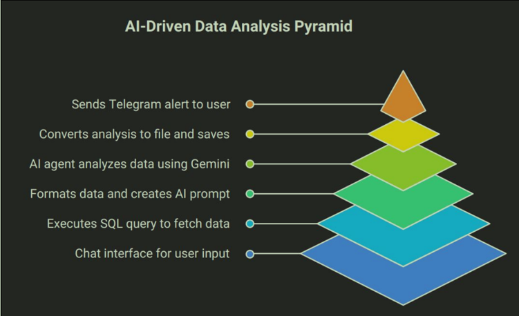
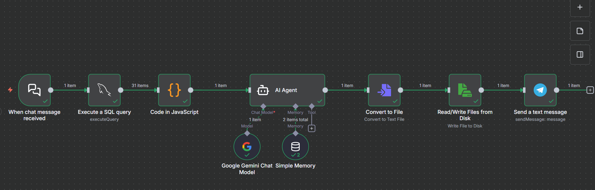
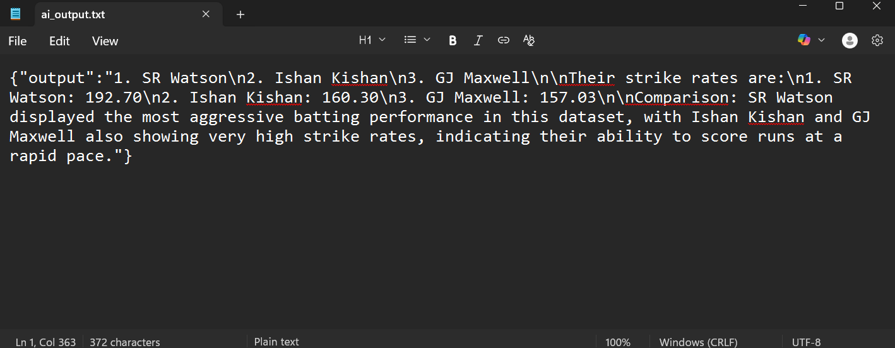

# 🧠 AI-Powered Data Analyst Workflow  
### Automated Insights with n8n, Google Gemini, MySQL & Telegram  

---

## 🌟 Overview  

This project brings data analytics to life by creating an **AI Data Analyst Assistant** that can chat, analyze, and respond intelligently to cricket statistics queries.  

Using **n8n automation**, **Google Gemini AI**, and a **MySQL database**, the system:  

- 💬 Interacts with users via chat  
- 🗄️ Retrieves and analyzes real-time data  
- 🧠 Generates insightful reports  
- 📲 Notifies users instantly via Telegram  

—all automatically.  

---

## 🧩 Workflow Highlights  

| Step | Process | Description |
|------|----------|-------------|
| 💬 1 | Chat Trigger | The interaction begins when the user sends a message to the chatbot — like chatting with a real data analyst. |
| 🗄️ 2 | SQL Query Execution | Connects to the MySQL database to fetch cricket batsmen statistics in real time. |
| 🧠 3 | AI Data Analysis | The Google Gemini model analyzes data patterns like top scorers and highest strike rates. |
| 🧾 4 | File Creation | Converts insights into a well-structured text report automatically. |
| 💾 5 | File Storage | Saves the generated report on the n8n server directory. |
| 📲 6 | Telegram Notification | Sends an instant Telegram message to notify users that the report is ready. |

---

## 🧭 Workflow Diagrams  

### 🔹 Normal Workflow  
  

### 🔹 n8n Workflow Implementation  
This shows the actual automation sequence inside n8n.  

**🧩 n8n Workflow Snapshot:**  
Here’s the visual overview of my automated workflow built using n8n 👇  
  

💡 **Description:**  
This snapshot represents the automation process built in n8n, where each node handles a specific task such as triggering chat input, fetching data from MySQL, sending it to Google Gemini for AI analysis, saving the output file, and notifying the user via Telegram.  

---

## 🔄 How It Works  

1. **Start the Chat:**  
   User greets the assistant and asks questions (e.g., “Who are the top three batsmen by strike rate?”).  
2. **Database Connection:**  
   The system connects to the MySQL database and retrieves cricket data.  
3. **AI-Powered Analysis:**  
   Google Gemini AI analyzes player performance and generates insights.  
4. **Report Generation:**  
   Results are formatted and saved as a `.txt` file.  
5. **Instant Notification:**  
   A Telegram message confirms report creation and provides the file location.  

---

## 🧠 Core Features  

- ✨ **AI-Driven Insights:** Real-time intelligent analysis using Google Gemini  
- 💬 **Conversational Interface:** Natural, chat-based interaction  
- 🧠 **Smart Memory:** Retains last 15 messages for context-aware responses  
- 🗃️ **Real-Time Database Access:** Live MySQL queries  
- 📁 **Automated Report Generation:** Neatly formatted AI reports  
- 📱 **Telegram Notifications:** Instant alerts for completed analyses  

---

## 🧰 Technologies Used  

### 🧩 Tools  
- n8n – Workflow automation engine  
- Google Gemini AI – Intelligent data analysis and language understanding  
- Telegram Bot API – User interaction and notifications  
- JavaScript – Data formatting and logic scripting  

### 🗄️ Resources  
- MySQL Database – Source of cricket batsmen statistics  
- File System (n8n storage) – For saving generated reports  

---

## ⚙️ Setup Instructions  

### 1️⃣ Prerequisites  
- Node.js and npm installed  
- MySQL database with cricket data  
- n8n (desktop or self-hosted) installed  
- Google Gemini API key (from Google AI Studio)  
- Telegram Bot Token & Chat ID  

---

### 2️⃣ Configure n8n Workflow  

| Step | Node | Description |
|------|------|-------------|
| 1 | Telegram Trigger | Triggers the workflow when a chat message is received. |
| 2 | MySQL Node | Connects to the cricket database (configure host, user, password, DB). |
| 3 | JavaScript Node | Formats or summarizes SQL query results. |
| 4 | AI Agent Node (Gemini) | Processes and interprets data using the Gemini model. |
| 5 | Convert to File Node | Converts AI output into a `.txt` report. |
| 6 | Write to Disk Node | Saves report in `/home/node/files/ai_output.txt`. |
| 7 | Telegram Message Node | Sends notification to user once the report is ready. |

---

## 🧾 Sample Output  

### Report Example  

🧾 Sample Output
Report Example:
Top 3 Batsmen by Strike Rate:
1. Virat Kohli – 134.6
2. Rohit Sharma – 128.3
3. KL Rahul – 126.9

Insight: Kohli leads with both aggression and consistency, followed closely by Rohit and Rahul.

📁 **File Location:**  
`/home/node/files/ai_output.txt`  

  

📲 **Telegram Notification:**  
“✅ Your cricket analysis report is ready! Check the saved file in /home/node/files.”    

---

## 🌱 Future Enhancements  

- 🚀 Multi-table database analysis  
- 📊 Chart-based visual analytics  
- 📅 Scheduled report generation  
- 🔐 User authentication system  
- 📄 Export to PDF/Excel  
- 💬 Natural Language → SQL query translation  

---

## 💡 Why This Project  

This project demonstrates how **AI + Automation** can simplify complex data analytics.  
By combining **Google Gemini’s intelligence** with **n8n’s automation**, users can query and interpret cricket data instantly and conversationally — no code needed.  

It’s a step toward **humanized analytics**, where data answers back.  

---

## 🏁 Conclusion  

The **AI-Powered Data Analyst Workflow** seamlessly merges automation, intelligence, and interaction.  
It turns analytics into a conversation, reports into automation, and insights into action — powered by **n8n, Google Gemini, MySQL, and Telegram**.  

---

## 🔗 Project Links  

- 🎞️ **Demo Video:** [Watch Here](https://github.com/Hasini78/dataanalyst_workflow/blob/main/workflow_recording/data%20analyst_recording.mp4)  
- 🧾 **Documentation:** [View PDF](https://github.com/Hasini78/data-analyst_workflow/blob/main/documentation/Data%20analyst%20documentation.pdf)  
- 📊 **Presentation (PPT):** [View Slides](https://github.com/Hasini78/data-analyst_workflow/blob/main/data%20analyst_ppt/Data%20Analyst_ppt.pptx)  
